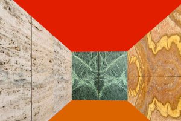
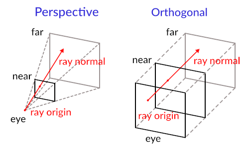

<!--
<p align="center">
  
</p>
-->


# Cub3D Project

<video width="600" height="400" loop autoplay muted>
  <source src="doc/pic/game.mp4" type="video/mp4">
  Dein Browser unterstützt dieses Videoformat nicht.
</video>

Cub3D is a project I developed to create a 3D maze game inspired by classic titles like "Wolfenstein 3D." The project is built in C and utilizes the MiniLibX graphics library to render a dynamic 3D environment using raycasting. It challenged me to dive deep into graphics programming, implement mathematical concepts like trigonometry for 3D effects, and optimize performance.


## Key Objectives:

1. **Understanding Ray-Casting**: Learn the fundamentals of ray-casting, a technique used to render 3D scenes by calculating the path of rays from the viewer's perspective and detecting intersections with objects in the environment.
2. **Field of View (FOV)**: Incorporate a 60° FOV to accurately project a 3D view from a 2D grid map.
3. **Grid Mapping**: Transform a given map into a 2D grid and use this to navigate and render the 3D maze.
4. **Intersection Calculations**: Calculate both vertical and horizontal intersections to determine the distances to walls and render the scene accurately.
5. **Rendering Multiple Rays**: Calculate and render multiple rays within the FOV to create a complete and immersive 3D view.

## Learning Outcomes:

- **Enhanced C Programming Skills**: Deepen your understanding of C programming through practical application.
- **Algorithmic Thinking**: Develop problem-solving skills by implementing complex algorithms for ray-casting and rendering.
- **Graphics Programming**: Gain an introduction to the basics of graphics programming, setting a foundation for more advanced topics in computer graphics and game development.

Cub3d is not just about coding; it's about bringing together math, logic, and creativity to create an engaging virtual experience. By the end of the project, you will have a solid grasp of ray-casting and a completed 3D maze exploration game to showcase your skills.

## Getting Started

To get started with the Cub3D project, follow these steps:

### Prerequisites

- A Unix-based operating system (Linux or macOS) or a compatible environment on Windows (such as WSL).
- Basic knowledge of C programming and command-line tools.

### Installation

1. **Clone the Repository**

   Open your terminal and run the following command to clone the Cub3D repository:

   ```bash
   git clone https://github.com/ELREKO/cub3d.git
   ```

2. **Navigate to the Project Directory**

   Change into the project directory:

   ```bash
   cd cub3d
   ```

3. **Build the Project**

   Compile the project using the provided Makefile:

   ```bash
   make
   ```

4. **Run the Program**

   After building the project, you can run the Cub3D executable with the following command:

   ```bash
   ./cub3d maps/good/<map>.cub
   ```
  -  `<map>` us a map form the folder.

  Here is a instruction how to [creat a map](doc/info/creat_map.md)

### Usage

- **Navigate the Maze**: Use the arrow keys to move forward `w`, backward `s`, left `a`, right `d` and turn left `arrow left` or right `arrow right`.
- **Exit the Game**: Press the `ESC` key to quit the game.

## Main Concept of Raycasting

To understand raycasting with the Digital Differential Analyzer (DDA), refer to the detailed [raycasting guide](doc/info/Calculation_the_Ray.md).

For a comprehensive raycasting tutorial that utilizes rotation matrices, check out this [raycasting tutorial](https://lodev.org/cgtutor/raycasting.html).

---
## Example Raycasting

<p align="center">
  
</p>
